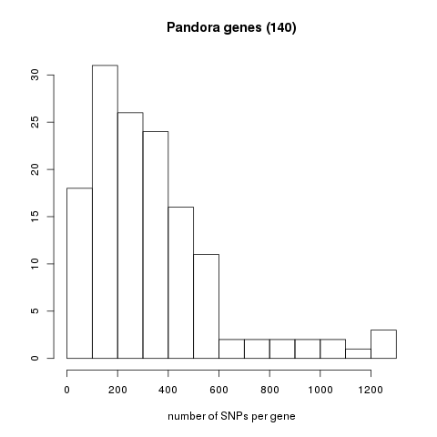
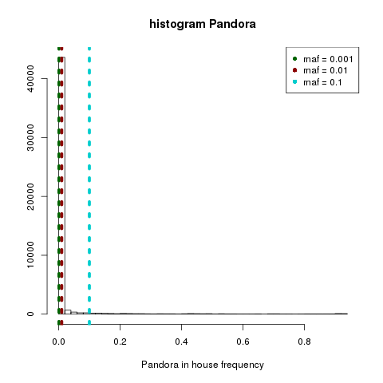
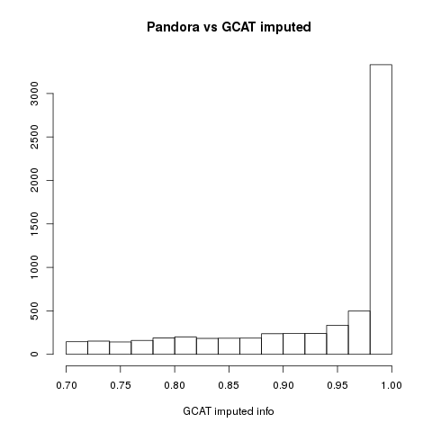
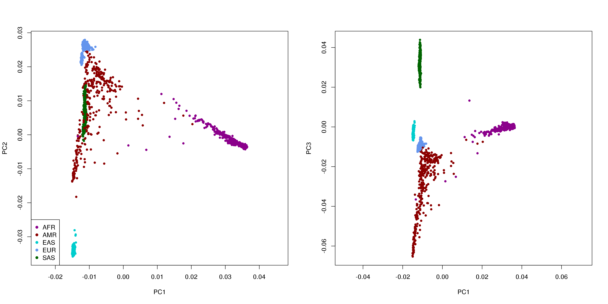
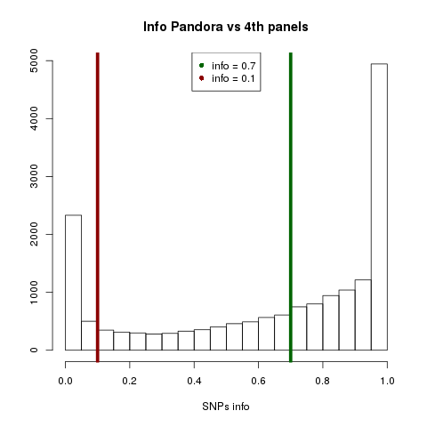
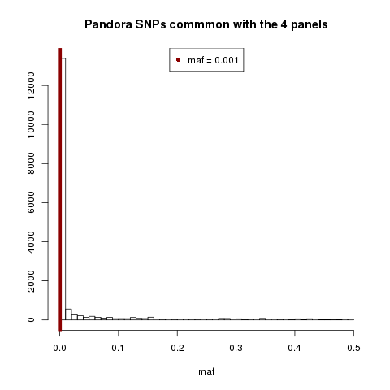

## 01_First_data_visualization

The first data we receive is some information about the genes and SNPs we are going to study.

We want to check it to know more about it and have an idea of how to work with the data.

The .xlsx file we receive contain the following variables:

	- gene
	- cDNA annotation
	- Protein annotation
	- NM (Accession Number)
	- Transcrip region
	- Exon in transcript name
	- Validated cDNA
	- Validated protein
	- Effect 
	- Validated effect
	- G start (chromosome and position)
	- Ref (Referential allele)
	- Alt (Alternative allele)
	- %FP
	- inROI
	- Classification
	- Additional risk information
	- User
	- CI date (Internal Classification Data)
	- Intervar
	- Reasoning
	- Comments
	- dbSNP
	- ClinVar
	- In house frequency (frequency of all samples)
	- In house number (total number of samples containing this SNP)
	- Pop freq max (maximun population frequency)
	- N_1000G_eur (1000Genomes August 2015)
	- Exac nfe
	- Polyphen2 hdiv pred
	- Polyphen2 hvar pred
	- Mutation assessor pred
	- Mutation taster pred
	- Provean pred

We want to cross Pandora with out internal database and other open databases, to know how many common SNPs have this databases with Pandora. 

Table1. Total number of SNPs in each of the datasets we are going to use.

|                            | Total number of SNPs |
|----------------------------|----------------------|
| Pandora                    | 45,489               |
| SNParray GCAT (maf = 0.01) | 756,003              |
| Imputation (maf = 0.01)    | 15,380,370           |
| 1000Genomes (maf = 0.01)   | 14,131,756           |
| 1000Genomes (no filter)    | 82,732,419           |

Table2. Total number of SNPs in common between Pandora and the selected databases.

|                                     | Total number of SNPs |
|-------------------------------------|----------------------|
| Pandora vs SNParray (maf = 0.01)    | 496                  |
| Pandora vs imputed (maf = 0.01)     | 6,085                |
| Pandora vs 1000Genomes (maf = 0.01) | 5,182                |
| Pandora vs 1000Genomes (no filter)  | 15,340               |

This results show a small percentage of shared SNPs between Pandora and the other datasets, but this can have an explanation. 

One important point is that the other datasets are very general in comparison with Pandora. That means Pandora dataset includes only 135 genes but a lot of variants (and in general rare variants) for this genes. In the other databases we have a lot of genes but small number of variants per gene, this is easy to see in the SNPs positions, if this positions are very close, as in Pandora, that means we have a lot of close variants.

In other hand we are using filtered data: we have filters by minor allele frequency (maf) > 0.01, which means the rare SNPs where deleted, but in Pandora we have all the data without filters. To see if this is significant a histogram of the *in house frequency* variable was plotted. 

In Pandora we have a lot of rare variants:

	- 45,256 SNPs with maf smaller than 0.1
	- 42,713 SNPs with maf smaller than 0.01
	- 31,816 SNPs with maf smaller than 0.001

Also the imputed filtered data have been filtered by info > 0.7. A histogram was made in order to see the info distribution of the common alleles (the info is a quality measure for the imputation).

We also perform a PCA analysis in order to know if we loose the differentiation capacity of the SNPs between population, when we select the common SNPs between Pandora and 1000Genomes. The results shows a wide lost of differentiation capacity but still we can be able to differentiate between populations.

After made the same comparisson between Pandora and 1000Genomes but without the maf filter we found an increase in the number of SNPs but still have 2/3 of Pandora SNPs without coincidence in the 1000Genomes dataset. The repetition of the PCA shows similar results. 

The comparisson with dbSNP database neither shows a goo SNPs coincidence (169 common SNPs).

On account of all this information we decide to search for the Pandora variants in all the fourth available panels we have (1000Genomes phase 3, Genomes of Netherlands, haplotype reference consorcium and Uk10k) and without filters, in the raw data. 

In the case of found the same variant in more than one panel we will select the one with higher info for this SNP. 

Finally 17,252 unique SNPs were found, and most of them with high info (9,687 with info higher than 0.7).

We also check the maf and found that 7,561 common SNPs have maf = 00, that means this is a monomorphic position, and from this monomorphic sites 2,208 have a very high info (info > 0.7).

We also studied the genes and their length and proximity between them, trying to guess if we can find groups of genes but nothing relevant was found.

