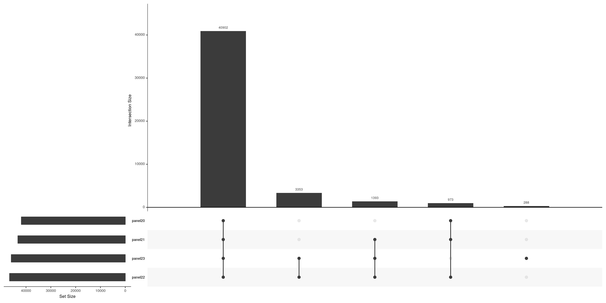

#  MERGE OF THE DATASETS (PANDORA AND GCAT)  

In this section we are going to select the common variants, prepare the dataset and make the merge between the data from the GCAT individuals and the data from the Pandora individuals.

In order to merge the two datasets we need to:
 - **Have the same variables (SNPs) in both datasets**
    Inicially, we have 35893 SNPs in Pandora and 17252 in GCAT imputed,  finally we obtain 14559 common between both and without duplications.
 - **Have the same order of the variants** 
    We order in both datasets the SNPs by chromosome_position
 - **Have the same reference and alternative allele for each SNP in both datasets**
    We filter the SNPs with the same both alleles in both datasets and the ones with reference allele in dataset1 equal to the alternative allele in dataset2 and alternative allele in dataset1 equal to reference allele in dataset2. In this section we discard 844 SNPs. So, from the 14559 alleles common we now have 13715.
    We need to take into account that when we flip the alternative and reference allele we need to change the genotype too.
 - **Have the Pandora genotypes as three columns**
    We will have the values of the columns as 100 if the genotype is 0/0, 010 if the genotype is 1/0, 001 if the sample is 1/1 and 000 if it is an unkown value.
    The problem is that we have from Pandora the genotypes 1/1 and 1/0 but not the 0/0 and the missing values can be a 0/0 or a real missing value.
    We consider the option of get only the information from one panel (figure 1) but we loose a lot of information and finally we decide to mantain all panels and check one by one if it is real or fake missing.
 

  
  *Figure 1. All SNPs in Pandora by panel. In common between the two panels 40902.*
  
  
 
  
  *Figure 2. Subset of 13747 SNPs in Pandora by panel. In common between the two panels 11753.*
  
   
  
  The problem is that if we select only the SNPs in common between the four panels we find that we loose information about 21 genes. 
  
  Therefore, we decide to check one by one the missing genotypes and check if this SNP is analyzed on the panel used with this sample or not. 

  Then we transform this 1/1, 1/0, 0/0 or missing into three columns with its correspondent value. 
  

**Finally, when we have all this we can merge the samples into a file my_final_genotypes with 13718 sNPs and ??? samples. The format of the output file is:**

| 10  | rs3818470:104263675:T:C | 104263675 | T   | C   | 0   | 1   | ... |
|-----|:-----------------------:|----------:|-----|-----|-----|-----|-----|
| 10  |     10:104263732_C_T    | 104263732 | C   | T   | 1   | 0   | ... |
| 10  |     10:104263877_C_T    | 104263877 | C   | T   | 1   | 0   | ... |
| ... |           ...           |       ... | ... | ... | ... | ... | ... |

