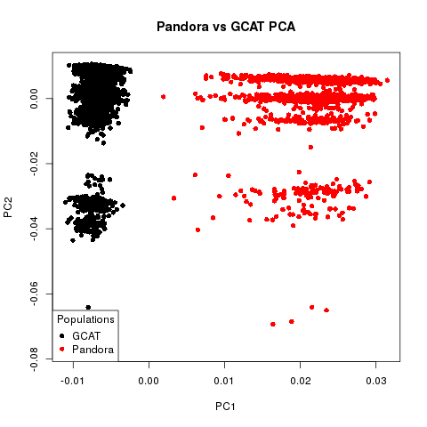
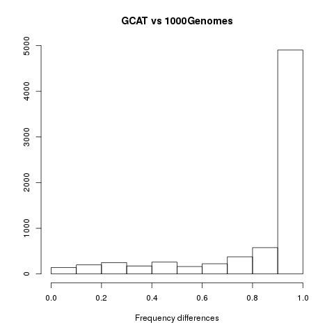

## 5. GWAS Preparation

### General checking: GCAT + Pandora

With PLINK we obtain the frequences of the full dataset (the merge of GCAT plus Pandora) and we check them. 

Check the maf frequencies with an histogram, we saw that in general we have rare variants (with small maf):

We filtered this rare variants with maf > 0.01 and made a PCA:

The result is horrible, as we can see there are two differenciated groups (GCAT and Pandora), this result shows big differences between the groups.

Due to this result we decide to check GCAT and Pandora separated to make sure this differences are real.

### Separated frequency analysis 

We repeat the frequency analysis of PLINK with both groups and then merge the data and calculate the difference between the freq in the GCAT and Pandora populations for each variable. With this we can see the SNPs which shows very different frequencies between the two populations. We also add information from the Pandora information file.

We obtain a file with the following information for each variant:

- Chromosome
- ID
- REF in frequency files
- ALT in frequency files
- Alt frequency in GCAT
- Observations in GCAT (number of times this variant was found in GCAT)
- Alt frequency in Pandora
- Observations in Pandora (number of times this variant was found in Pandora)
- Difference of frequency between GCAT and Pandora 
- chromosome_position
- Ref from Pandora information
- Alt from Pandora information
- in House number from Pandora information (number of times this variant was found)
- in House frequency from Pandora information (frequency of this variant in Pandora)
- Frequence of this variant in 1000Genomes

We check the correspondence between the frequencies from GCAT and 1000Genomes and we see they are very similar:

Also check the differences between GCAT and Pandora:

To see the big differences we filtered by a difference between Pandora and GCAT  > 0.1:

We wanted to see the classification of the very different SNPs in Pandora information, they have information about six different classifiers: Sift pred, two polyphen classifications, mutation assessor, mutation taster and provean prediction. We found that  from the 76 variants with higher than 0.7 difference in frequency only one was classified as not-functional.

With a difference higher than 0.2 we found 451 variants, only the previous one cited and other two (neutral variants) have classification. 

Then we search about the number of observations of each of this 451 variants, we found that 88 variants observed in less than 100 individuals. So, we decided to filter this variants. 

We use *filter(OBS_CT_PANDORA > (90x3162/100))* to filter all the variants with less than 90% observations.

We also filter the differences in the frequencies between Pandora and GCAT higher than 0.2.

We again saw the differences between GCAT and Pandora with this variants filtered, the result was very similar. 

Finally, we wanted to find a filter to this variants with high differences. We try differnt filters based on CI but finally we made a first try with a filter of < 0.2 differences between GCAT and Pandora. 

**Save the selected variants with the diff < 0.2 filter as *first_final_subset* **

Now check the selected variables with a PCA:

And also check a diff < 0.01 filter and results were very similar:

**Finaly: we have *first_final_subset* in PLINK format containing 13023 variants and 6569 samples.

### Additional information about the classifications:

-  Sift pred: D = deleterious, T = tolerant.
-  Polyphen: B = benign, D = probably damaging, P = possibly damaging.
-  Mutation assessor: 
      - Predicted non-functional: L = low, N = neutral.
      - Predicted functional: H = high, M = medium.
-  Mutation taster: A = disease causing automatic, D = disease causing, N = polymorphism (not damaging), P = polymorphism automatic (not damaging).
- Provean_pred: D = deleterious, N = neutral.

