## 06 GWAS PREPARATION                                                               

First we had to modify the psam file to add the information of control/case for each cancer type. 

We have the following cancer types:

- Control                -> Control 
- Breast                 -> Breast
- Polyposis              -> Colon
- BC/OC/HBOC + Other     -> Breast + Ovary 
- HNPCC                  -> Colon
- HBOC                   -> Breast + Ovary
- Ovary                  -> Ovary

We have 4 different cathegories:
- **pheno**: include all the SNPs, 1 = control (GCAT) and 2 = case. **6569 samples**
- **ovarian**: 1 = control (GCAT), 2 = ovarian classified patients, NA = other cancer patients. **5412 samples**
- **breast**: 1 = control (GCAT), 2 = breast classified patients, NA = other cancer patients. **5819 samples**
- **colon**: 1 = control (GCAT), 2 = colon classified patients, NA = other cancer patients. **5307 samples**

Then we perform 4 different GWAS one with each group, and made Manhattan plots in order to visualize it. 

We obtain the following correlated SNPs:
- **pheno**: 412 SNPs belonging to 101 genes. 
- **ovarian**: 188 SNPs belonging to 74 genes.
- **breast**: 318 SNPs belonging to 94 genes.
- **colon**: 153 SNPs belonging to 69 genes. 

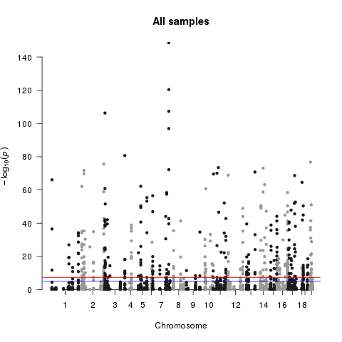

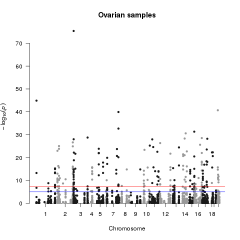

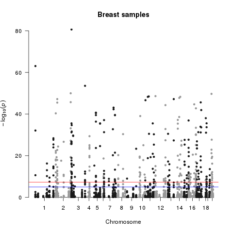

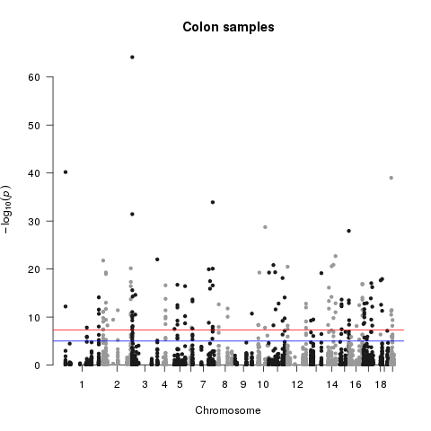

Also, check the common number of genes between the tree different cancer types:

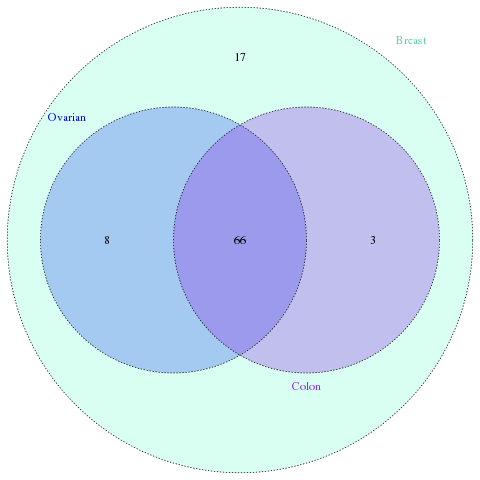

We need to divide the data into Training (70%) and Test (30%) set, for that we add another 6 columns indicating NA when the sample is from another cancer type or belonging to the other set and 1 for control and 2 for case. 

Finally we have the **.psam** file with the following format:

| #FID |     IID    | SEX | pheno | ovarian | breast | colon | pheno_70 | pheno_30 | ovarian_70 | ovarian_30 | breast_70 | breast_30 | colon_70 | colon_30 |
|------|:----------:|----:|-------|---------|--------|-------|----------|----------|------------|------------|-----------|-----------|----------|----------|
| 1    | AAA323**** |   2 | 1     | NA      | 1      | 1     | 1        | NA       | 1          | NA         | NA        | 2         | 1        | 1        |
| 2    | AAA323**** |   2 | 1     | 1       | 2      | 1     | NA       | 1        | NA         | NA         | 1         | NA        | NA       | NA       |
| 3    | AAA323**** |   1 | 1     | 2       | 1      | 2     | NA       | 1        | 2          | NA         | 2         | NA        | 1        | NA       |
| 4    | AAA323**** | 2   | 2     | 1       | NA     | 1     | 2        | NA       | 1          | 1          | 2         | 2         | 2        | NA       |
| ...  | ...        | ... | ...   | ...     | ...    | ...   | ...      | ...      | ...        | ...        | ...       | ...       | ...      | ...      |

We repeat the GWAS with this 70% subset that means we have the following samples per set:

|         | Training set (70%) | Test set (30%) |
|:-------:|:------------------:|:--------------:|
| General |        4598        |      1971      |
| Ovarian |        3801        |      1611      |
|  Breast |        4076        |      1743      |
|  Colon  |        3708        |      1599      |

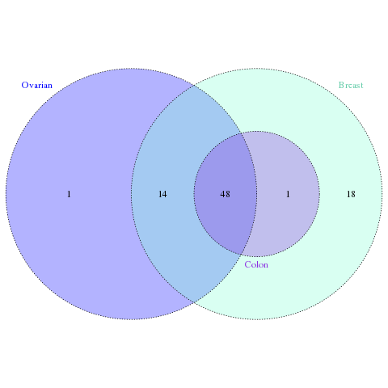

This table summarize the correlated SNPs and genes information with this analysis we made:

|         | Correlated SNPs 100% | Correlated genes 100% | Correlated SNPs 70% | Correlated genes 70% |
|:-------:|:--------------------:|:---------------------:|---------------------|----------------------|
| General |          412         |          101          | 323                 | 92                   |
| Ovarian |          188         |           74          | 139                 | 63                   |
|  Breast |          318         |           94          | 248                 | 81                   |
|  Colon  |          153         |           69          | 91                  | 49                   |

Manhattan plots with teh training dataset:

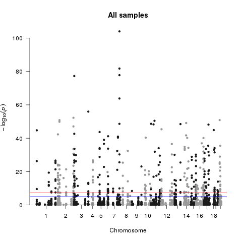

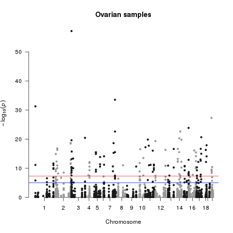

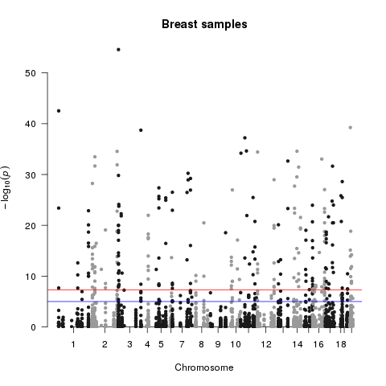

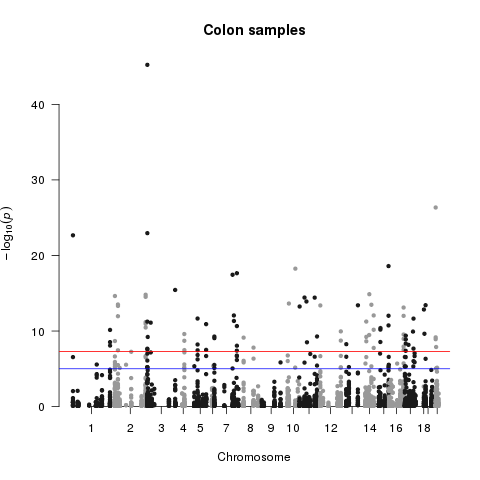

We also obtain visual information of the correlated SNPs with manhattan plots by chromosome and cancer type:

Chromosome 2, for General:

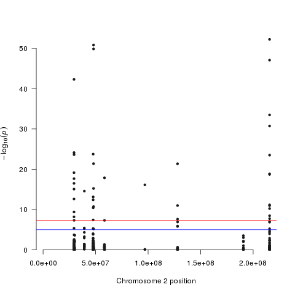

Chromosome 2, for Ovarian Cancer:

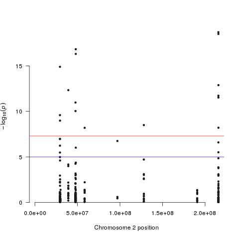

Chromosome 2, for Breast Cancer:

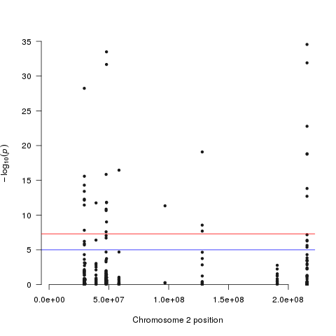

Chromosome 2, for Colon Cancer:

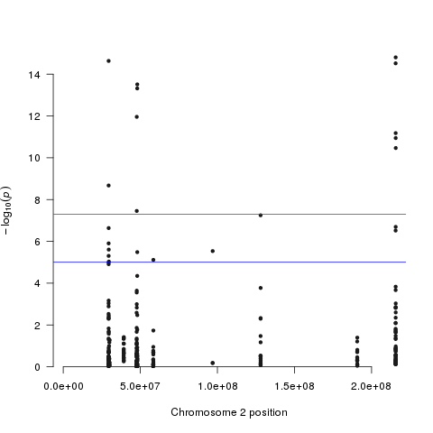

