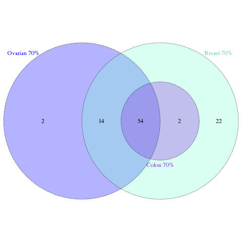

## 06. GWAS                                                               

First we had to modify the psam file to add the information of control/case for each cancer type. 

We have the following cancer types:

- Control (206)               -> Control 
- Breast (813)                -> Breast
- Polyposis (198)             -> Colon
- BC/OC/HBOC + Other (48)     -> Breast + Ovary 
- HNPCC (190)                 -> Colon
- HBOC (199)                  -> Breast + Ovary
- Ovary (292)                 -> Ovary

We have 4 different cathegories:
- **pheno**: include all the SNPs, 1 = control (GCAT) and 2 = case. **6569 samples**
- **ovarian**: 1 = control (GCAT), 2 = ovarian classified patients, NA = other cancer patients. **5412 samples**
- **breast**: 1 = control (GCAT), 2 = breast classified patients, NA = other cancer patients. **5819 samples**
- **colon**: 1 = control (GCAT), 2 = colon classified patients, NA = other cancer patients. **5307 samples**

Then we perform 4 different GWAS one with each group, and made Manhattan plots in order to visualize it. 

We obtain the following correlated SNPs:
- **pheno**: 385 SNPs belonging to 97 genes. 
- **ovarian**: 169 SNPs belonging to 70 genes.
- **breast**: 297 SNPs belonging to 92 genes.
- **colon**: 124 SNPs belonging to 56 genes. 

Also, check the common number of genes between the tree different cancer types:

We need to divide the data into Training (70%) and Test (30%) set, for that we add another 6 columns indicating NA when the sample is from another cancer type or belonging to the other set and 1 for control and 2 for case. 

Finally we have the **.psam** file with the following format:

| #FID |     IID    | SEX | pheno | ovarian | breast | colon | pheno_70 | pheno_30 | ovarian_70 | ovarian_30 | breast_70 | breast_30 | colon_70 | colon_30 |
|------|:----------:|----:|-------|---------|--------|-------|----------|----------|------------|------------|-----------|-----------|----------|----------|
| 1    | AAA323**** |   2 | 1     | NA      | 1      | 1     | 1        | NA       | 1          | NA         | NA        | 2         | 1        | 1        |
| 2    | AAA323**** |   2 | 1     | 1       | 2      | 1     | NA       | 1        | NA         | NA         | 1         | NA        | NA       | NA       |
| 3    | AAA323**** |   1 | 1     | 2       | 1      | 2     | NA       | 1        | 2          | NA         | 2         | NA        | 1        | NA       |
| 4    | AAA323**** | 2   | 2     | 1       | NA     | 1     | 2        | NA       | 1          | 1          | 2         | 2         | 2        | NA       |
| ...  | ...        | ... | ...   | ...     | ...    | ...   | ...      | ...      | ...        | ...        | ...       | ...       | ...      | ...      |

We repeat the GWAS with this 70% subset that means we have the following samples per set:

|         | Training set (70%) | Test set (30%) |
|:-------:|:------------------:|:--------------:|
| General |        4598        |      1971      |
| Ovarian |        3801        |      1611      |
|  Breast |        4076        |      1743      |
|  Colon  |        3708        |      1599      |

This table shows the number of case and controls for each group of cancer and the training and test set:

|         | Case (70%) | Control (70%) | Case (30%) | Control (30%) |
|:-------:|:----------:|:-------------:|------------|---------------|
| General |     943    |      3515     | 432        | 1539          |
| Ovarian |     295    |      3506     | 129        | 1482          |
|  Breast |     584    |      3492     | 247        | 1496          |
|  Colon  |     219    |      3489     | 100        | 1499          |

This table summarize the correlated SNPs and genes information with this analysis we made, we use a suggestive threshold for the P value (P < 1e-6):

|         | Correlated SNPs 100% | Correlated genes 100% | Correlated SNPs 70% | Correlated genes 70% |
|:-------:|:--------------------:|:---------------------:|---------------------|----------------------|
| General |          412         |          101          | 373                 | 97                   |
| Ovarian |          188         |           74          | 169                 | 70                   |
|  Breast |          318         |           94          | 297                 | 92                   |
|  Colon  |          153         |           69          | 124                 | 56                   |

*** Posible solution: an explanation can be that we lost statistical power, but also the rare variants get lost when we decrease the N, a posible solution can be make different samples of 70% and repeat the analysis. 

Manhattan plots with teh training dataset:

We also obtain visual information of the correlated SNPs with manhattan plots by chromosome and cancer type:

Chromosome 2, for General:

Chromosome 2, for Ovarian Cancer:

Chromosome 2, for Breast Cancer:

Chromosome 2, for Colon Cancer:

**IMPORTANT:**

Correlated variants information in: <group>_variants2.txt 

