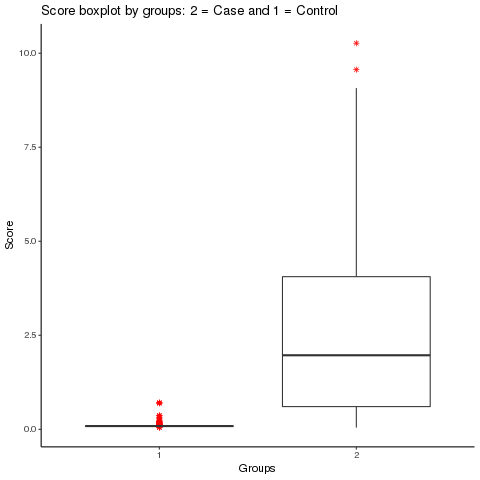

## 7. PRS

Now we want to calculate predictive models with the selected SNPs as correlated for each of the cancer groups. 

Table1. Samples for each set (training and test) and groups of cancer.

|         | Case (70%) | Control (70%) | Case (30%) | Control (30%) |
|:-------:|:----------:|:-------------:|------------|---------------|
| General |     943    |      3515     | 432        | 1539          |
| Ovarian |     295    |      3506     | 129        | 1482          |
|  Breast |     584    |      3492     | 247        | 1496          |
|  Colon  |     219    |      3489     | 100        | 1499          |

With PLINK we have calculate the scores for each phenotype (each cancer group) for the training sample (70% of the total sample) and then look at the results with some plots. We visualize that both groups (case and control) are separated:

Boxplot for general group:

The same but with log10 applied to the scores:

Also, we made a density plot:

And we repeat this for the other cancer groups.

Boxplot with log10:

Density plot:

We calculate with the training set a linear model to predict the cancer response, they we apply this model to the test set (30% of the total sample). To visualize the results we create a contingency table and we calculate the AUC (area under the curve).

Table 2. General results.

|           |        | Observed | Observed |
|-----------|:------:|---------:|----------|
|           |        |   Cancer | Health   |
| Predicted | Cancer |      397 | 449      |
| Predicted | Health | 35       | 1024     |

We have:
- 397: CORRECT cancer as cancer --> 91.89815
- 1024: CORRECT control as health --> 69.51799
- 35: INCORRECT cancer as health -->  8.101852
- 449: INCORRECT health as cancer  --> 30.48201

Table 3. Ovarian results.

|           |        | Observed  | Observed |
|-----------|:------:|----------:|----------|
|           |        |    Cancer | Health   |
| Predicted | Cancer |       109 |  2       |
| Predicted | Health | 20        | 1480     |

We have:
- 109: CORRECT cancer as cancer --> 84.49612
- 1480: CORRECT control as health --> 99.86505
- 20: INCORRECT cancer as health -->  15.50388
- 2: INCORRECT health as cancer  --> 0.1349528

Table 4. Breast results.

|           |        | Observed  | Observed |
|-----------|:------:|----------:|----------|
|           |        |    Cancer | Health   |
| Predicted | Cancer |       217 | 30       |
| Predicted | Health | 30        | 1466     |

We have:
- 217: CORRECT cancer as cancer --> 87.85425
- 1466: CORRECT control as health --> 97.99465
- 30: INCORRECT cancer as health -->  12.14575
- 30: INCORRECT health as cancer  --> 2.005348

Table 5. Colon results.

|           |        | Observed  | Observed |
|-----------|:------:|----------:|----------|
|           |        |    Cancer | Health   |
| Predicted | Cancer |        71 | 7        |
| Predicted | Health | 29        | 1492     |

We have:
- 71: CORRECT cancer as cancer --> 71
- 1492: CORRECT control as health --> 99.53302
- 29: INCORRECT cancer as health -->  29
- 7: INCORRECT health as cancer  --> 0.466978

Table 6. Total results for all groups.

|         | Sensitivity | Specificity | AUC    |
|---------|:-----------:|------------:|--------|
| General |  0.9189815  |   0.6951799 | 0.7181 |
| Ovarian |  0.8449612  |   0.9986505 | 0.9843 |
| Breast  | 0.8785425   | 0.9799465   | 0.9292 |
| Colon   | 0.71        | 0.9953302   | 0.9456 |
