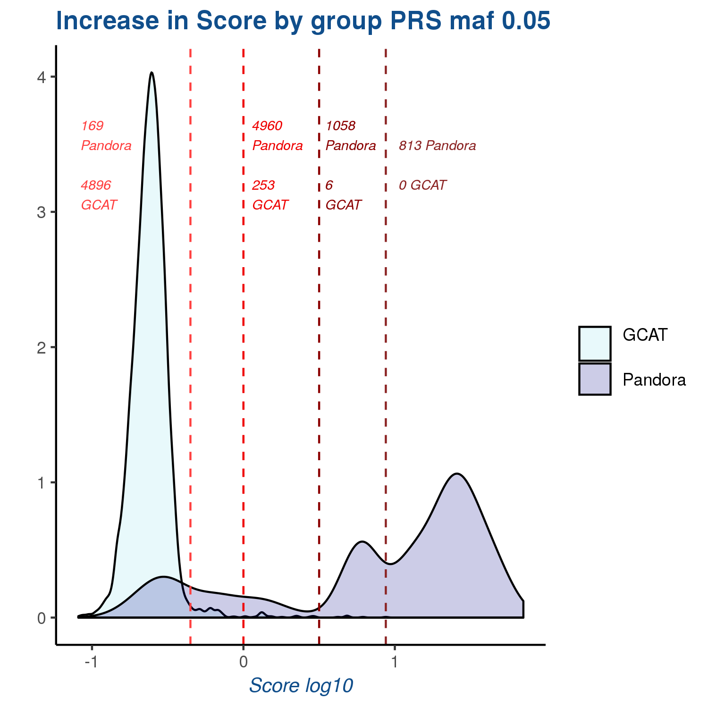
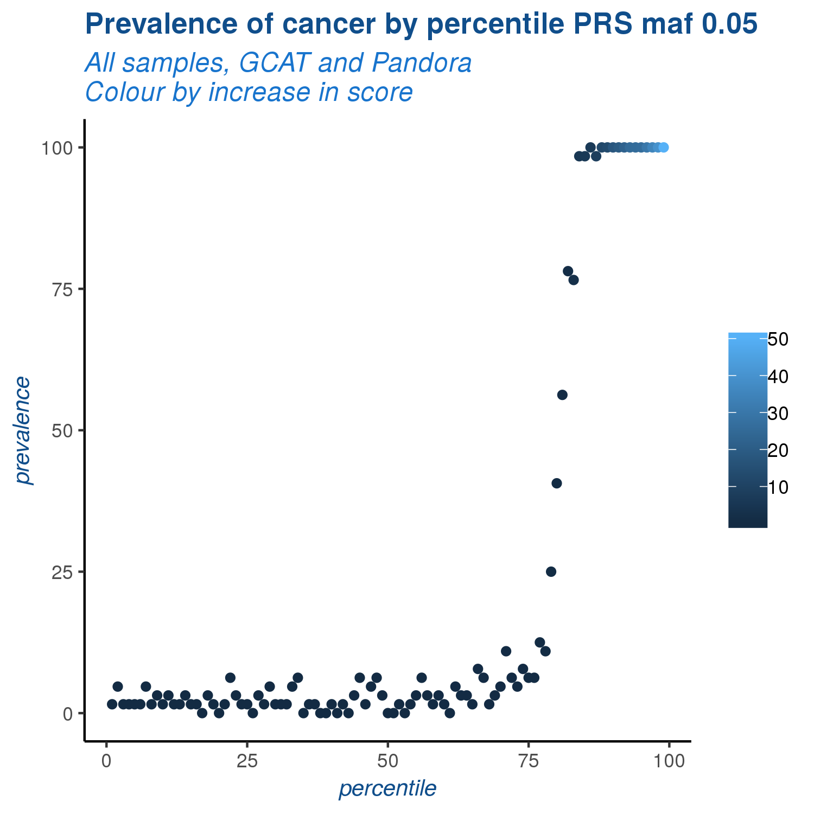
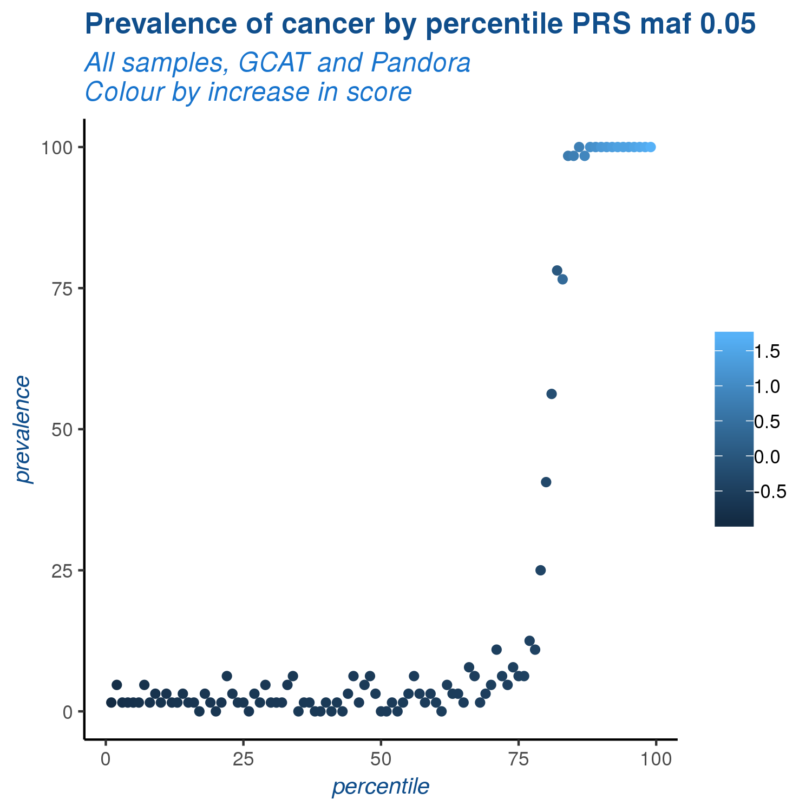
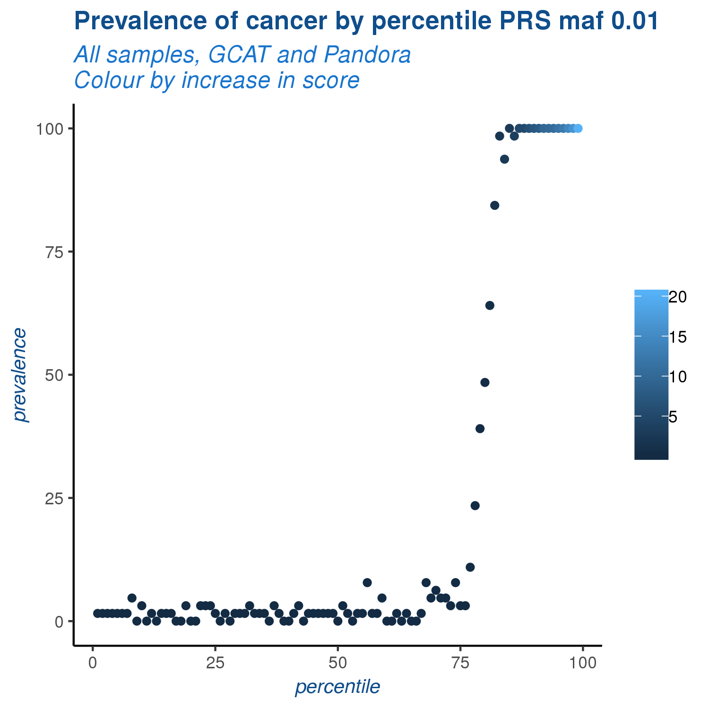

# 08. PRS advanced

With a loop we explore different variables in order to obtain the best model to classify the groups, the variables we explore are:

- MAF_cases: the maf filter for the cases, it means we will use all the variables over this threshold of the cases.
  - maf > 0.05
  - maf > 0.01
  - maf > 0.001
- P_value_threshold. We consider significant the p-values smaller than the threshold.
  - p_value_threshold < 0.05
  - p_value_threshold < 0.01
  - p_value_threshold < 1e-3
  - p_value_threshold < 1e-4
  - p_value_threshold < 1e-5
  - p_value_threshold < 1e-6
  - p_value_threshold < 5e-8
- LD-pruning. We use indep-pairwise of PLINK to obtain a list of non-linked variants, the YES option use only this independent variants, NO use all.
- classification_threshold. The threshold we use after prediction to classify the samples in case and control.
  - classification_threshold > 0.05 considered as case
  - classification_threshold > 0.07 considered as case
  - classification_threshold > 0.10 considered as case
  - classification_threshold > 0.2 considered as case
  - classification_threshold > 0.3 considered as case
  - classification_threshold > 0.4 considered as case
  - classification_threshold > 0.45 considered as case
  - classification_threshold > 0.5 considered as case
  - classification_threshold > 0.55 considered as case
  
  
| MAF_cases | p_value_threshold | LD_pruning | classification_threshold | N_snps |  sensitivity |  specificity |      AUC     |
|:---------:|:-----------------:|:----------:|:------------------------:|:------:|:------------:|:------------:|:------------:|
|    0,05   |      0,000001     |     YES    |           0,07           |   41   |  0,900462963 | 0,9775967413 |  0,946402834 |
|    0,05   |       0,0001      |     YES    |           0,07           |   46   | 0,8981481481 |  0,978275628 | 0,9470899471 |
|    0,05   |      0,00001      |     YES    |           0,07           |   45   | 0,8981481481 | 0,9775967413 | 0,9459828031 |
|    0,05   |       0,001       |     YES    |           0,07           |   57   | 0,8958333333 | 0,9755600815 | 0,9422646223 |
|    0,01   |        0,05       |     YES    |           0,05           |   261  |    0,9375    | 0,9490835031 | 0,9124013158 |
|    0,01   |        0,01       |     YES    |           0,05           |   182  |    0,9375    | 0,9531568228 | 0,9177812276 |
|    0,01   |       0,0001      |     YES    |           0,05           |   105  |    0,9375    | 0,9592668024 |  0,926108871 |
|    0,01   |       0,001       |     YES    |           0,05           |   134  | 0,9351851852 | 0,9599456891 | 0,9265763593 |
|   0,001   |        0,05       |     YES    |           0,05           |   844  | 0,9537037037 | 0,9402579769 | 0,9048825623 |
|   0,001   |        0,01       |     YES    |           0,05           |   452  | 0,9467592593 | 0,9443312967 | 0,9083639889 |
|   0,001   |       0,001       |     YES    |           0,05           |   241  | 0,9398148148 | 0,9565512559 | 0,9228556602 |
|   0,001   |       0,0001      |     YES    |           0,05           |   164  | 0,9398148148 | 0,9606245757 | 0,9284784872 |
|   0,001   |      0,00001      |     YES    |           0,05           |   127  | 0,9305555556 | 0,9266802444 | 0,8833649589 |
|   0,001   |        0,05       |     YES    |           0,07           |   844  | 0,9282407407 | 0,9755600815 | 0,9482514855 |

We consider the following as the best models for each maf threshold value:

| MAF_cases | p_value_threshold | LD_pruning | classification_threshold | N_snps |  sensitivity |  specificity |      AUC     |
|:---------:|:-----------------:|:----------:|:------------------------:|:------:|:------------:|:------------:|:------------:|
|    0,05   |      0,000001     |     YES    |           0,07           |   41   |  0,900462963 | 0,9775967413 |  0,946402834 |
|    0,01   |       0,0001      |     YES    |           0,05           |   105  |    0,9375    | 0,9592668024 |  0,926108871 |
|   0,001   |        0,05       |     YES    |           0,05           |   844  | 0,9537037037 | 0,9402579769 | 0,9048825623 |

We visualize the predictive power of each of this selected models with the following graphs:

### maf threshold = 0.05

### maf threshold = 0.01

### maf threshold = 0.001

