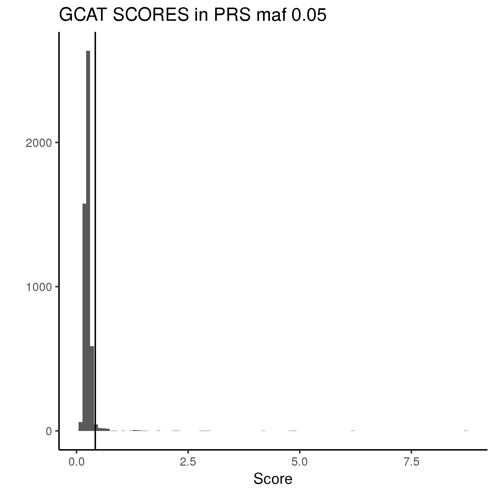
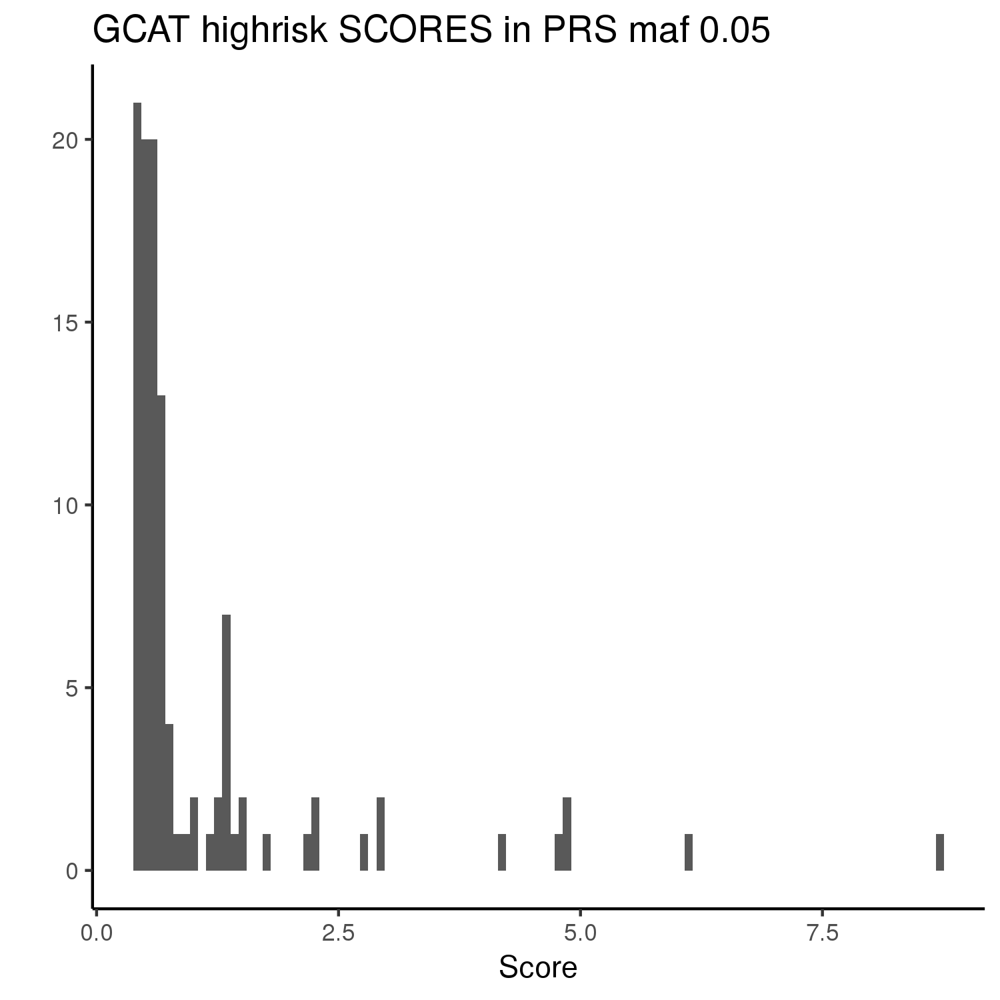
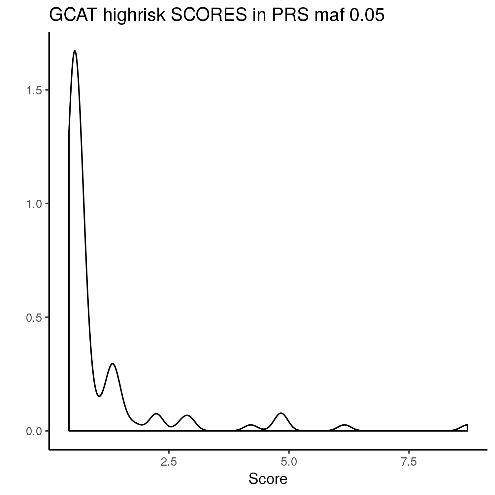

# 09. Check Results

### 1. Check the higher score GCAT participants

We check that the information from GCAT and Pandora of the GCAT individuals (genotypes) are the same.

We want to check the GCAT participants with higher scores and check their conditions from the GCAT database. 

From the 4988 GCAT individuals we have 107 with a score higher than 0.4 (2.1% of all the GCAT individuals). 

Figure 1. Shows all the GCAT scores and set the threshold in 0.4, all the higher individuals are the 107 selected. 

We plot the 107 higher values, we make histogram and density plot:

We also check other 3 thresholds: 

- Score > 6 have 1 individual
- Score > 4 have 5 individuals 
- Score > 2 have 11 individuals 

*Table 1. False positives and Cancers categorized as health in the three models.*

|            | False positive (%) | Cancers as healthy (%) for 27 individuals | Ovarian/Breast/Colon cancer as health (%) from 10 individuals |
|:----------:|:------------------:|:-----------------------------------------:|:-------------------------------------------------------------:|
|  Model 005 |    2,2403258656    |                    100                    |                              100                              |
|  Model 001 |    4,0733197556    |                    100                    |                              100                              |
| Model 0001 |    5,9742023082    |                    100                    |                              100                              |

We want to center the investigation in hereditary and familiar cancer so, we check hpw many of this 27 cancer patients have Ovarian, Breast or Colon cancer, and there are 10. From this 10 individuals 5 of them have familiar antecedents:

*Table 2. Individuals with Ovarian, Breast or Colon cancer and Cancer antecedents.*

| Gender | Patient cancer type | Familiar | Familiar cancer type |
|:------:|:-------------------:|:--------:|:--------------------:|
|   Men  |  Bladder and **Colon**  |  **Parents** |         **Colon**        |
|  Women |        **Breast**       |  **Parents** |        **Breast**        |
|  Women |        Breast       |  Parents |        Bladder       |
|  Women |        Breast       |  Parents |       Prostate       |
|  Women |        Breast       |  Brother |        Bladder       |

The two first are posible hereditary or familiar cancer. 

Then we check the bad classified individuals (classified as cases) to check their antecedents for the three selected models.

Also we create the following tables for training and test set:

- Information of all individuals and antecedents: **GCAT_30%_allinformation.xlsx** and **GCAT_70%_allinformation.xlsx**.
- Information of all cancer types from individuals and antecedents: **GCAT_30%_cancers.xlsx** and **GCAT_70%_cancers.xlsx**.
- Information of all Ovarian, Breast and Colon cancers in individuals and antecedents: **GCAT_30%_ourcancers.xlsx** and **GCAT_70%_ourcancers.xlsx**.

We also check the maf of each of the models.

Finally we create two tables with the information of all Genes **genes_inPRS_allmodels.xlsx** and SNPs **SNPs_inPRS_allmodels.xlsx** indicating for which models them belong. 

*Table 3. All genes in the models information.*

|  Gene | Chromosome |  Position |        ID       | P            | OR       | A1_CASE_FREQ | A1_CTRL_FREQ | CI                | Breast | Ovarian | CMOH: Ovarian and Breast | Poliposis: Colon | CCHNP: Colon | Young Colon | Li-Fraumeni | Melanoma | Gastric | Erdhein Chester: Blood | Renal | Pancreas | Prostate | AHG | GWAS_PRS | model0001 | model001 | model005 |
|:-----:|:----------:|:---------:|:---------------:|--------------|----------|--------------|--------------|-------------------|--------|---------|--------------------------|------------------|--------------|-------------|-------------|----------|---------|------------------------|-------|----------|----------|-----|----------|-----------|----------|----------|
| A2ML1 |     12     |  8988403  |  12:8988403_A_C | 7,41027E-011 | 4,65808  | 0,0219957    | 0,00521904   | 2.93154-7.40148   | 0      | 0       | 0                        | 0                | 0            | 0           | 0           | 0        | 0       | 0                      | 0     | 0        | 0        | 0   | 0        | Yes       | Yes      | No       |
|  AIP  |     11     |  67257273 | 11:67257273_G_T | 1,80203E-018 | 3,43613  | 0,0540685    | 0,0103762    | 2.60767-4.52779   | 0      | 0       | 0                        | 0                | 0            | 0           | 0           | 0        | 0       | 0                      | 0     | 0        | 0        | 0   | 0        | Yes       | Yes      | Yes      |
|  ALK  |      2     |  29449526 |    rs1881419    | 2,15452E-046 | 0,270419 | 0,0763521    | 0,240541     | 0.226046-0.323502 | 0      | 0       | 0                        | 0                | 0            | 0           | 0           | 0        | 0       | 0                      | 0     | 0        | 0        | 0   | 0        | Yes       | Yes      | Yes      |
|  APC  |      5     | 112164747 | 5:112164747_A_G | 0,0291148    | 1,36962  | 0,0360551    | 0,0267279    | 1.03251-1.81679   | 0      | 0       | 0                        | 1                | 0            | 0           | 0           | 0        | 0       | 0                      | 0     | 0        | 0        | Yes | colon    | Yes       | No       | No       |
|  ...  |     ...    |    ...    |       ...       | ...          | ...      | ...          | ...          | ...               | ...    | ...     | ...                      | ...              | ...          | ...         | ...         | ...      | ...     | ...                    | ...   | ...      | ...      | ... | ...      | ...       | ...      | ...      |

*Table 4. All SNPs in the models information.*

| Gene  | Chromosome | Position | ID             | P            | OR       | A1_CASE_FREQ | A1_CTRL_FREQ | CI                | Breast | Ovarian | CMOH: Ovarian and Breast | Poliposis: Colon | CCHNP: Colon | Young Colon | Li-Fraumeni | Melanoma | Gastric | Erdhein Chester: Blood | Renal | Pancreas | Prostate | AHG | GWAS_PRS | model0001 | model001 | model005 |
|-------|:----------:|---------:|----------------|--------------|----------|--------------|--------------|-------------------|--------|---------|--------------------------|------------------|--------------|-------------|-------------|----------|---------|------------------------|-------|----------|----------|-----|----------|-----------|----------|----------|
| A2ML1 |     12     |  8988403 | 12:8988403_A_C | 7,41027E-011 | 4,65808  | 0,0219957    | 0,00521904   | 2.93154-7.40148   | 0      | 0       | 0                        | 0                | 0            | 0           | 0           | 0        | 0       | 0                      | 0     | 0        | 0        | 0   | 0        | Yes       | Yes      | No       |
| A2ML1 |     12     |  8994212 | 12:8994212_T_C | 0,0107468    | 4,14708  | 0,00375536   | 0,00100626   | 1.39024-12.3707   | 0      | 0       | 0                        | 0                | 0            | 0           | 0           | 0        | 0       | 0                      | 0     | 0        | 0        | 0   | 0        | Yes       | No       | No       |
| A2ML1 |     12     |  9000501 | 12:9000501_C_G | 1,58824E-009 | 0,364101 | 0,0273605    | 0,0625842    | 0.262256-0.505497 | 0      | 0       | 0                        | 0                | 0            | 0           | 0           | 0        | 0       | 0                      | 0     | 0        | 0        | 0   | 0        | Yes       | Yes      | No       |
| A2ML1 | 12         | 9020680  | 12:9020680_G_A | 0,0315511    | 1,36915  | 0,0375536    | 0,0283917    | 1.02817-1.82322   | 0      | 0       | 0                        | 0                | 0            | 0           | 0           | 0        | 0       | 0                      | 0     | 0        | 0        | 0   | 0        | Yes       | No       | No       |
| A2ML1 | 12         | 8988470  | 12:8988470_G_A | 0,0238399    | 7,91965  | 0,00214592   | 0,000330007  | 1.31585-47.6656   | 0      | 0       | 0                        | 0                | 0            | 0           | 0           | 0        | 0       | 0                      | 0     | 0        | 0        | 0   | 0        | Yes       | No       | No       |
| ...   | ...        | ...      | ...            | ...          | ...      | ...          | ...          | ...               | ...    | ...     | ...                      | ...              | ...          | ...         | ...         | ...      | ...     | ...                    | ...   | ...      | ...      | ... | ...      | ...       | ...      | ...      |

